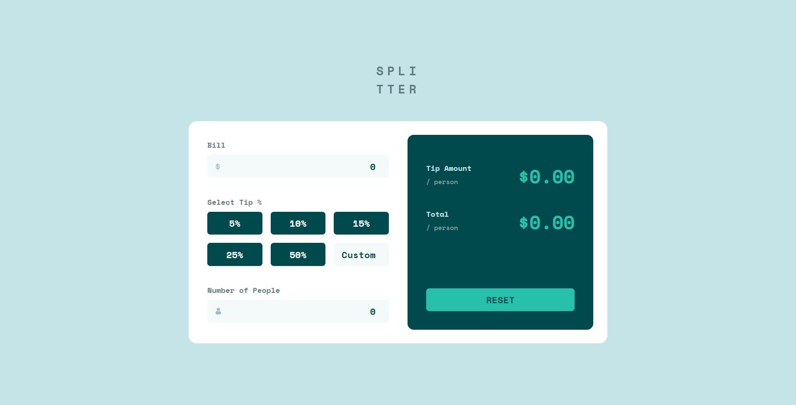

# Frontend Mentor - Tip calculator app solution

This is a solution to the [Tip calculator app challenge on Frontend Mentor](https://www.frontendmentor.io/challenges/tip-calculator-app-ugJNGbJUX). Frontend Mentor challenges help you improve your coding skills by building realistic projects.

## Table of contents

- [Overview](#overview)
  - [The challenge](#the-challenge)
  - [Screenshot](#screenshot)
  - [Links](#links)
- [My process](#my-process)
  - [Built with](#built-with)
  - [What I learned](#what-i-learned)
  - [Continued development](#continued-development)
  - [Useful resources](#useful-resources)
- [Author](#author)

## Overview

### The challenge

Users should be able to:

- View the optimal layout for the app depending on their device's screen size
- See hover states for all interactive elements on the page
- Calculate the correct tip and total cost of the bill per person

### Screenshot

### Links

- Solution URL: [https://www.frontendmentor.io/solutions/tip-calculator-built-using-sass-and-vanilla-javascript-X-2vnrkm0W](https://www.frontendmentor.io/solutions/tip-calculator-built-using-sass-and-vanilla-javascript-X-2vnrkm0W)
- Live Site URL: [https://tip-calculator-app-ai.netlify.app/](https://tip-calculator-app-ai.netlify.app/)

## My process

### Built with

- Semantic HTML5 markup
- CSS custom properties
- Flexbox
- CSS Grid
- Mobile-first workflow
- Sass SCSS syntax
- Vanilla JavaScript

### What I learned

In this project I practiced my CSS and JavaScript skills. In case of CSS it was practicing writing Sass. In case of JavaScript it was managing the app state, validating inputs, manipulating DOM and formating numbers and values using the localization API.

### Continued development

In the future I'd like to get more comfortable with using CSS Grid and use it where it's more appropriate.

### Useful resources

On this [MDN link](https://developer.mozilla.org/en-US/docs/Web/API/Constraint_validation) you can learn more about Constraints Validation API that I used to validate the input fields in realtime.

On this [MDN link](https://developer.mozilla.org/en-US/docs/Web/JavaScript/Reference/Global_Objects/Intl/NumberFormat) you can lern more about number formating API that I used to format currency values in this project.

On this [link](https://www.learnhowtoprogram.com/user-interfaces/building-layouts-preprocessors/7-1-sass-architecture) you can learn more about Sass 7-1 Architecture that I used to structure my Sass in this project.

On this [link](http://getbem.com/) you can learn more about BEM naming convention that I used to name my classes in this project.

## Author

- Frontend Mentor - [@andrijaivkovic](https://www.frontendmentor.io/profile/andrijaivkovic)
- Twitter - [@AndrijaIvkovic1](https://www.twitter.com/AndrijaIvkovic1)
